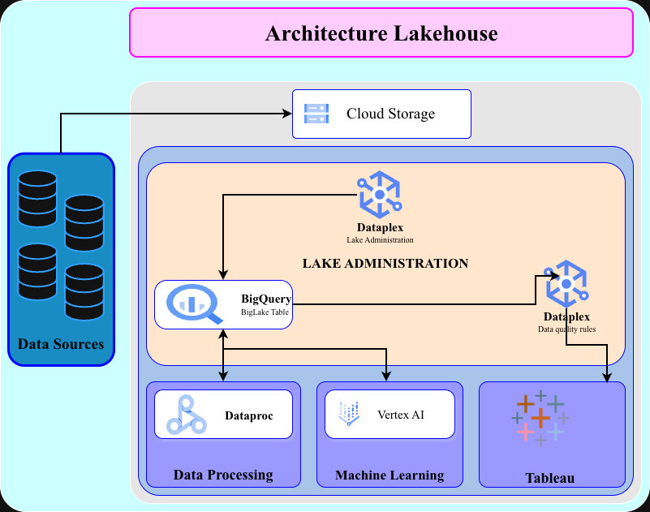

# GCP Lakehouse From Scratch

End-to-end **Analytics Lakehouse** on **Google Cloud**, built **from scratch** with an **enterprise-oriented approach**, automated using **Terraform** and **BigQuery SQL**.

This project demonstrates how to unify a **data lake** and a **data warehouse** by combining:

- **Cloud Storage** (open formats: Parquet)
- **BigLake + BigQuery** (unified access & analytics)
- **Terraform** (Infrastructure as Code)
- **BigQuery SQL** (data transformations & modeling)
- *(planned)* **Dataplex** for governance and catalog
- *(planned)* **Cloud-native orchestration (Cloud Run / Workflows)**

> 🎯 **Goal**: showcase a clean, realistic, enterprise-like lakehouse implementation deployable on any GCP project.

---

## Architecture



### High-level data flow

1. Data lands in **Cloud Storage (RAW layer)**
2. Files are exposed to BigQuery via **BigLake**
3. Transformations are executed using **BigQuery SQL**
4. Data is promoted through **CURATED** and **GOLD** layers
5. Curated data is ready for **BI, analytics, or ML consumption**

---

## Data Layers & Modeling

This project follows a **layered data architecture**, inspired by industry standards (Bronze / Silver / Gold).

### RAW layer (Bronze)
- **Storage**: Google Cloud Storage
- **Format**: Parquet
- **Purpose**:
  - First landing zone
  - Immutable, schema-on-read
  - No business logic
- **Provisioning**: Terraform (GCS module)

### CURATED layer (Silver)
- **Storage**: BigQuery managed tables
- **Purpose**:
  - Typed and cleaned data
  - Data quality enforcement (`SAFE_CAST`)
  - Technical metadata for lineage and audit
- **Provisioning**:
  - BigQuery datasets via Terraform
  - Transformations via BigQuery SQL

### GOLD layer
- **Storage**: BigQuery
- **Purpose**:
  - Business-ready tables
  - Aggregations and KPIs
- **Examples**:
  - Aggregations by business keys
  - Metrics tables for BI consumption

---

## Infrastructure as Code (Terraform)

All infrastructure is provisioned using **Terraform**, following modular and reusable patterns.

### Provisioned resources
- **Cloud Storage buckets**
  - RAW
  - CURATED
- **BigQuery**
  - Datasets
  - BigLake connection
- **IAM**
  - Bucket-level permissions for BigLake service account

### Design principles
- Environment-based deployments (`dev`, `prod`)
- Standardized naming conventions
- Consistent labels (FinOps, governance, ownership)
- Modular design (`modules/gcs`, `modules/bigquery`)

---

## SQL Transformations

Data transformations are implemented using **BigQuery SQL**, organized by data layer.

```
sql/
├── 01_external/
│   └── External BigLake tables
├── 02_curated/
│   └── Typed BigQuery managed tables
└── 03_gold/
└── Business aggregations
```


### SQL characteristics
- Deterministic execution order by layer
- Template-based SQL (`.sql.tpl`) with environment substitution
- Enterprise-ready patterns:
  - `SAFE_CAST` for robustness
  - Technical columns (`ingestion_ts`, `source_object`, `env`)
  - Explicit lineage and traceability

---

## Orchestration

### Current state (implemented)
- SQL orchestration via **bq CLI**
- Layer-based execution order
- Controlled execution using a shell runner
- Designed for **local development and validation**

### Future evolution (planned)
- Cloud-native orchestration using **Cloud Run** or **Workflows**
- Scheduling with **Cloud Scheduler**
- CI/CD integration

> Orchestration is intentionally kept simple at this stage to focus on correctness, structure, and data modeling.

---

## Repository Structure

```
├── docs/
│   └── architecture/
├── terraform/
│   ├── envs/
│   │   ├── dev/
│   │   └── prod/
│   ├── modules/
│   └── scripts/
│       └── run_bigquery.sh
├── sql/
│   ├── 01_external/
│   ├── 02_curated/
│   └── 03_gold/
├── .github/workflows/
└── README.md
```

---

## Prerequisites

- A **Google Cloud project** with billing enabled
- Local tooling:
  - `gcloud`
  - `terraform`
  - `bq`
  - `git`

---

## Roadmap

	•	Provision GCS buckets (raw / curated)
	•	BigQuery datasets & BigLake connection
	•	IAM permissions for BigLake access
	•	SQL transformations (raw → curated → gold)
	•	Dataplex integration (catalog & governance)
	•	CI/CD Terraform pipeline
	•	Cloud-native orchestration (Cloud Run / Workflows)
	•	Optional Spark processing (Dataproc / Iceberg)


---

## Disclaimer

This repository is intended for **learning and portfolio purposes**.  
It is inspired by Google Cloud lakehouse reference architectures and demonstrates best practices, but it is **not a production landing zone by itself**.
